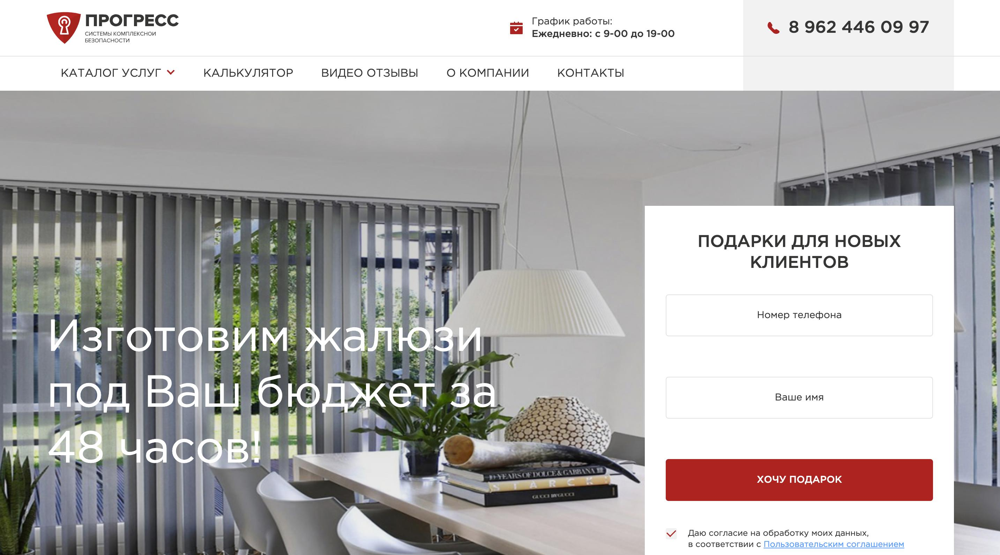

Название сайта: **Прогресс** [![Build status][travis-image]][travis-url] [![Dependency status][dependency-image]][dependency-url]

------------

Главная страница сайта: 🖥️ https://ioinitid.github.io/progress/index.html
Страница рулонные шторы: 📱 https://ioinitid.github.io/progress/curtains.html
Страница рольставни: 💻 https://ioinitid.github.io/progress/shutters.html
Страница ворота: ⌨️ https://ioinitid.github.io/progress/gates.html
Страница автоматика: 📡 https://ioinitid.github.io/progress/automation.html
Страница видеонаблюдение: 💡 https://ioinitid.github.io/progress/video.html
Страница окна: ⌚️ https://ioinitid.github.io/progress/windows.html
Страница алюминевые конструкции: 🔦 https://ioinitid.github.io/progress/aluminum.html
Страница видео отзывы: 🔋 https://ioinitid.github.io/progress/reviews.html
Страница о компании: 🗑 https://ioinitid.github.io/progress/about.html
Страница контакты: 🖱 https://ioinitid.github.io/progress/contacts.html

------------

**Превью сайта:**

------------

------------

Сделано с ❤️ в [WEB-ELITIT.RU](https://www.web-elitit.ru "Web-elitit.ru")
> Дизайн сайта: **WEB-ELITIT.RU: ООО "Прогресс"*

------------

**Папка с исходными файлами — `source/`.**

- [contributing.md](contributing.md) — руководство по сборке проекта.

------------

[travis-image]: https://travis-ci.com/htmlacademy-adaptive/1076505-cat-energy-18.svg?branch=master
[travis-url]: https://travis-ci.com/htmlacademy-adaptive/1076505-cat-energy-18
[dependency-image]: https://david-dm.org/htmlacademy-adaptive/1076505-cat-energy-18/dev-status.svg?style=flat-square
[dependency-url]: https://david-dm.org/htmlacademy-adaptive/1076505-cat-energy-18?type=dev
